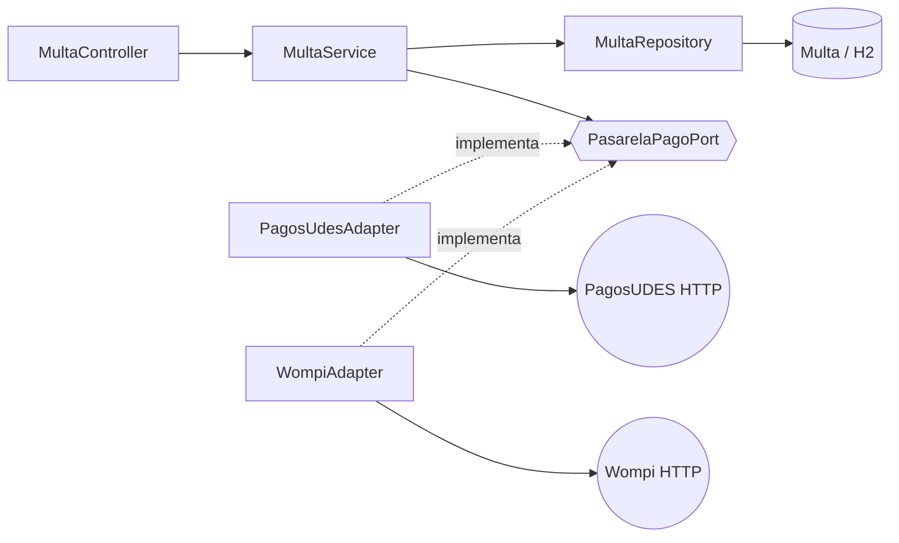

# Post-contenido — Unidad 7: Patrones Arquitectónicos I

**Autor:** [Nombre Apellido] · **Curso:** Patrones de Diseño de Software · **Unidad 7**

## Descripción
Un único proyecto Spring Boot (`multas-biblioteca-api`) para gestionar las multas de una biblioteca universitaria: se registra una multa cuando un estudiante devuelve un libro con retraso, se calcula su monto y se marca como pagada. Tiene dos partes:

- **Parte 1 — Arquitectura en capas** (Controller → Service → Repository → Model) sobre Spring Data JPA y H2, con dos reglas de negocio no triviales en `MultaService`/`Multa`.
- **Parte 2 — Pago en línea con dos pasarelas intercambiables** (PagosUDES y Wompi). Se resolvió con un **puerto de dominio y dos adaptadores** (arquitectura hexagonal *solo* en esta porción); el resto del proyecto sigue en capas.

## Prerrequisitos y ejecución
- JDK 17+ y Maven 3.8+.

```bash
cd multas-biblioteca-api
mvn clean package          # compila y ejecuta las pruebas
mvn spring-boot:run        # arranca en http://localhost:8080
```
- Consola H2: <http://localhost:8080/h2-console> (JDBC URL `jdbc:h2:mem:multas_biblioteca_db`, usuario `sa`, sin contraseña).
- **Probar el pago en línea sin pasarelas reales:** el proyecto incluye un simulador opcional de ambas pasarelas (solo existe con el perfil `simulador`; rechaza montos superiores a $10.000):
  ```bash
  mvn spring-boot:run -Dspring-boot.run.profiles=simulador
  ```
  Para usar Wompi en lugar de PagosUDES basta cambiar `app.pagos.proveedor=wompi` en `application.properties` y reiniciar (o, sin editar el archivo: `mvn spring-boot:run -Dspring-boot.run.profiles=simulador -Dspring-boot.run.arguments=--app.pagos.proveedor=wompi`). No se modifica ninguna clase.
- Para provocar un pago rechazado (402) con el simulador basta generar una multa de 21 días de atraso o más: $500 por día supera los $10.000 que el simulador acepta.
- Sin el perfil `simulador`, el pago en línea intentará conectarse a `localhost:9001/9002` y, al no haber servicio, responderá 402 "no disponible" (comportamiento esperado, ver Trade-off).

## Herramientas utilizadas
- Java 17, Spring Boot 3.2, Spring Web, Spring Data JPA, Bean Validation, H2 y `RestTemplate`.
- Maven, JUnit 5, MockMvc y `MockRestServiceServer` (pruebas), curl/Postman, Git y GitHub.

## Arquitectura

### Estructura de paquetes
```
multas-biblioteca-api/src/main/java/com/example/multas/
├── controller/           Presentación  MultaController, GenerarMultaRequest, GlobalExceptionHandler
├── service/              Aplicación    MultaService (reglas de negocio y orquestación)
├── model/                Dominio (Parte 1)  Multa, EstadoMulta, excepciones de negocio
├── repository/           Infraestructura    MultaRepository (Spring Data JPA)
├── domain/               Dominio (Parte 2, Java puro: sin Spring, JPA ni HTTP)
│   ├── port/PasarelaPagoPort.java
│   ├── SolicitudPago.java, ResultadoPago.java, PagoRechazadoException.java
└── infrastructure/       Adaptadores (sí conocen Spring y HTTP)
    ├── pago/PagosUdesAdapter.java, WompiAdapter.java
    ├── config/RestTemplateConfig.java
    └── simulador/SimuladorPasarelasController.java   (solo perfil "simulador")
```

### Dirección de las dependencias

`MultaService` depende de la **interfaz**; los adaptadores dependen del puerto (y no al revés). Ningún detalle de PagosUDES o Wompi llega al Service ni al Controller.

## Endpoints
| Método | URL | Éxito | Errores | Descripción |
|---|---|---|---|---|
| GET | `/api/multas` | 200 | — | Lista todas las multas |
| GET | `/api/multas/{id}` | 200 | 404 | Busca una multa |
| GET | `/api/multas/estudiante/{estudianteId}` | 200 | — | Multas de un estudiante |
| POST | `/api/multas` | 201 | 400 datos inválidos · 409 límite de 3 pendientes | Genera una multa (monto calculado) |
| PATCH | `/api/multas/{id}/pagar` | 200 | 404 · 409 ya pagada | Pago en ventanilla |
| POST | `/api/multas/{id}/pagar-en-linea` | 200 | 404 · 409 ya pagada · 402 pago rechazado | Pago con la pasarela activa |

## Pruebas
`mvn test` ejecuta 21 pruebas en 4 clases (unitarias y de integración con MockMvc): la regla de cálculo sin levantar Spring, todos los checkpoints de la Parte 1 (201/400/404/409), el pago en línea con PagosUDES y con Wompi (la pasarela se simula con `MockRestServiceServer`; la prueba de Wompi fija `app.pagos.proveedor=wompi` para demostrar que el cambio es solo de configuración) y que un segundo pago de una multa ya pagada da 409 **sin contactar a la pasarela**.

## Decisiones de diseño

### Punto de decisión 1 — Cálculo del monto: ¿entidad o Service?
**Elegido:** `Multa.calcularMonto(int)` (método estático de la entidad).
**Criterio usado:** si una regla no necesita ningún colaborador externo (Repository u otro Service) y depende solo de datos que recibe como parámetro, es candidata a vivir en el objeto de dominio. Lo que sí necesita colaboradores (contar multas, guardar, llamar a la pasarela) es orquestación y vive en el Service. Por el mismo criterio, la transición `marcarComoPagada` también está en la entidad: la propia `Multa` protege su invariante "una multa pagada no se paga dos veces".
**Alternativa descartada:** método privado en `MultaService`. Habría dejado a `Multa` como un contenedor de datos (modelo anémico) y cualquier otro punto que necesitara recalcular un monto tendría que duplicar la fórmula o pasar por el Service sin necesitar ninguna de sus dependencias.
**Evidencia:** `MultaTest` prueba el cálculo y el tope sin levantar Spring, algo que no sería posible si la regla estuviera en el Service.

### Punto de decisión 2 — Conteo de multas pendientes: ¿consulta o filtrado en memoria?
**Elegido:** `MultaRepository.countByEstudianteIdAndEstado`, que Spring Data traduce a `SELECT COUNT(*)`.
**Razón:** la *decisión* ("¿se le permite generar otra multa?") es de negocio y la toma solo `MultaService`; el *dato* que necesita se resuelve donde es eficiente: en el motor de base de datos. La alternativa (`findByEstudianteId` + filtrar con streams) trae todas las filas del estudiante a memoria y las hidrata como entidades solo para contarlas.
**Qué pasaría si creciera:** el costo de cada creación de multa crecería linealmente con el historial del estudiante (más filas leídas, más objetos, más memoria y latencia), mientras que el COUNT devuelve un único número y puede apoyarse en un índice compuesto `(estudiante_id, estado)` si el volumen lo justifica.
**Limitación conocida:** contar y luego insertar no es atómico; dos peticiones simultáneas del mismo estudiante podrían superar el límite de 3. Con una sola instancia y datos de práctica es aceptable; en producción se resolvería con bloqueo pesimista, nivel de aislamiento SERIALIZABLE o una restricción a nivel de base de datos.

### Punto de decisión 3 — Selección del adaptador activo
**Elegido:** `@ConditionalOnProperty(app.pagos.proveedor)`: en el contexto de Spring existe un único bean `PasarelaPagoPort`, así que `MultaService` lo pide por constructor sin `@Qualifier` ni `if`. `PagosUdesAdapter` es el valor por defecto (`matchIfMissing = true`).
**Alternativa descartada:** inyectar un `Map<String, PasarelaPagoPort>` y elegir la clave en tiempo de ejecución.
**Por qué:** el requisito es una pasarela fija por sede durante el piloto, y el Map obligaría a `MultaService` a conocer las claves de configuración de los proveedores (justo el acoplamiento que el puerto quiere evitar). Además, un valor de configuración inválido hace que la aplicación falle al arrancar (*fail-fast*) en vez de fallar en el primer pago.
**Qué se sacrifica:** cambiar de proveedor exige reiniciar, y una misma instancia no puede usar las dos pasarelas a la vez. Si una sede necesitara ambas, se agregaría un `PasarelaPagoRouter` en `infrastructure/` que implemente el puerto y delegue al adaptador correcto, sin tocar `MultaService`.

### Punto de decisión 4 — Diseño del puerto y del tipo de resultado
Ambos adaptadores reciben y devuelven formatos distintos (PagosUDES: `idTransaccion/estadoTransaccion`; Wompi: `reference/status` y montos en centavos), pero los traducen al mismo `ResultadoPago(proveedor, exitoso, referenciaExterna, mensaje)`.
- **Si el puerto devolviera el DTO de cada pasarela** (o tuviera un método por proveedor), `MultaService` tendría que distinguir formatos y agregar una tercera pasarela obligaría a modificarlo además de crear un adaptador.
- **Si `ResultadoPago` tuviera un campo `idTransaccion`** en lugar de `referenciaExterna`, `WompiAdapter` tendría que inventar un valor o reutilizar un nombre que no describe lo que Wompi devuelve: señal de que el tipo de dominio se habría diseñado a la medida de un proveedor y no de forma neutral.
- **Decisión adicional respecto al enunciado:** el puerto recibe un `SolicitudPago(multaId, estudianteId, monto)` en vez de la entidad `Multa`. La entidad lleva anotaciones de `jakarta.persistence` y `jakarta.validation`; si el puerto la recibiera, `domain/` dependería de JPA y ya no compilaría solo con `java.*` (el checkpoint de la Parte 2 lo pide). Con `SolicitudPago` el dominio queda realmente aislado y los adaptadores no pueden modificar la entidad por accidente.

### Trade-off considerado — Parte 2
**Opción elegida: C (puerto de dominio con dos adaptadores), solo en la porción de pago.**

*A favor de C (para este caso):*
1. Cada pasarela tiene un contrato HTTP distinto (nombres de campos, centavos vs. pesos, estados `APROBADA` vs. `APPROVED`). Con C esa diferencia queda encerrada en cada adaptador y no se filtra al Service.
2. Agregar una tercera pasarela es crear una clase que implementa el puerto; quitar una es borrarla. `MultaService`, `MultaController` y las pruebas de la Parte 1 no cambian, y el requisito pide explícitamente que ese conjunto pueda variar tras el piloto.
3. El dominio de pago es Java puro y las pasarelas se prueban de forma aislada (`MockRestServiceServer`), incluida la prueba que fija `wompi` por configuración.

*Opciones descartadas:*
- **A (rama condicional en `MultaService`):** el Service conocería los detalles HTTP de ambas pasarelas y cada cambio de proveedor obligaría a editar y reprobar código ya probado. Es la más rápida de escribir, pero es la que peor resiste el requisito de que las pasarelas cambien.
- **B (interfaz Strategy dentro de `service/`):** es la alternativa más cercana y honestamente también resolvería la intercambiabilidad. Se descartó porque las implementaciones seguirían viviendo en la capa de servicio mezclando reglas de aplicación con detalles HTTP, y porque, tal como se plantea en el enunciado, la interfaz recibiría la entidad `Multa`, con sus anotaciones JPA. Lo que se pierde al no elegirla es simplicidad: B habría requerido menos paquetes y menos indirección.

*Qué costó C:* dos paquetes nuevos (`domain/`, `infrastructure/`), tres tipos de dominio más el puerto, una configuración de `RestTemplate` y una convivencia de dos estilos en el mismo código (capas + puerto), con un nombre confuso: `model/` y `domain/` son ambos "dominio". Para solo dos proveedores, B habría sido defendible, y no descartaría esa decisión si el piloto terminara y quedara una sola pasarela: eliminar `WompiAdapter` es trivial, pero el puerto quedaría con una única implementación, es decir, indirección cuyo beneficio sería solo preventivo. En ese caso se evaluaría colapsarlo.

*Límites reconocidos de la implementación actual:*
- **Llamada HTTP dentro de `@Transactional`:** la conexión a la base de datos permanece abierta durante la llamada a la pasarela. Los timeouts de `RestTemplateConfig` (3 s de conexión, 5 s de lectura) acotan el problema, pero no lo eliminan.
- **Consistencia y reintentos:** si la pasarela aprueba y luego falla el `save`, el cobro existiría sin registro local; falta idempotencia (por ejemplo, reutilizar la referencia `multa-{id}`).
- **Pasarela caída → 402:** se sigue la especificación (mensaje "no disponible" con 402), aunque un 503 describiría mejor una falla de infraestructura que un rechazo.
- **La API expone la entidad `Multa` directamente:** aceptable para el alcance; con más consumidores se usarían DTO de respuesta.
- `RestTemplate` está en modo de mantenimiento; en un proyecto nuevo se preferiría `RestClient`.

## Conclusiones
La arquitectura en capas resolvió bien el problema mientras las reglas y los datos vivían en un solo lugar; lo más útil de la Parte 1 fue definir un criterio explícito para ubicar cada regla (¿necesita un colaborador externo?) en lugar de decidir por intuición. La Parte 2 mostró que el punto donde las capas empiezan a tensionarse es la frontera con sistemas externos de contrato variable: ahí la inversión de dependencias del puerto pagó su costo. Lo más difícil de decidir fue que la diferencia entre B y C es más sutil de lo que parece: ambas eliminan el `if`, y la ventaja real de C es aislar el dominio de los detalles de HTTP y de la persistencia, un beneficio que solo se aprecia si el sistema sigue creciendo. Por eso el alcance se limitó a la porción de pago y no se migró el resto del proyecto.

## Capturas de pantalla
Las capturas están en [`docs/`](docs/) (se reproducen con [`docs/probar-endpoints.sh`](docs/probar-endpoints.sh)):


